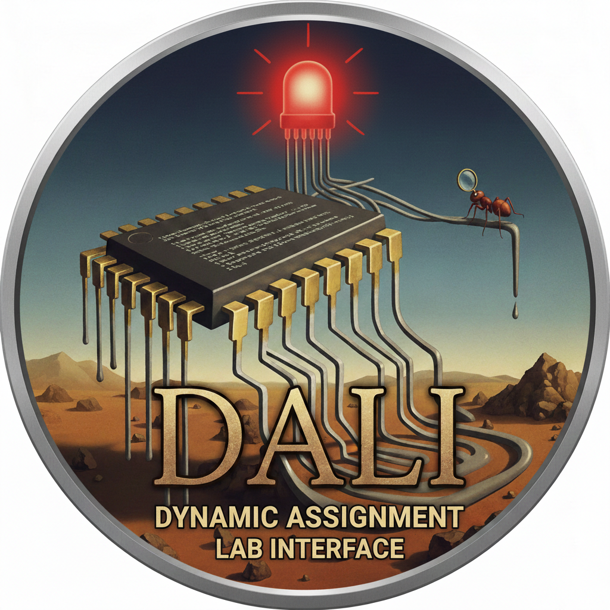

<p align="center">
  
</p>

# DALI — Dynamic Assignment Lab Interface

> Surreally simple submissions for embedded systems

DALI is a lab submission system for embedded systems courses. Students upload code files or PCB designs, run compilation or DRC checks against instructor-provided rules, and submit to Canvas — with a consistent file structure every time.

Built for **ELEC 327** at Rice University, targeting the TI MSPM0G3507.

---

## Features

**Students** upload only the files you specify, test compilation or run DRC checks before submitting, see their queue position in real time, and submit a clean zip to Canvas with one click. Template files fill in anything they don't upload.

**Instructors** get a live admin dashboard showing the compilation/DRC queue, per-assignment lab configs that enforce exactly which files are expected, and submissions that always have the same archive structure. Submissions appear directly in SpeedGrader as the student's actual submission. PCB assignments include DRC reports and board previews automatically bundled in the zip.

---

## Architecture

```
Flask web app  ──►  Redis queue  ──►  Worker process(es)
(app_complete.py)                     (compile_worker_main.py)
                                           │
                              ┌────────────┴────────────┐
                         TI ARM Clang              kicad-cli
                         (embedded C)           (PCB DRC + preview)
```

The web app enqueues compilation or DRC jobs. A separate worker process picks them up, generates a Makefile, runs `make`, and reports results back through Redis. You need both processes running. The worker automatically dispatches to the correct pipeline based on the lab type (`embedded_c` or `kicad_pcb`).

---

## Project Structure

```
dali/
├── app_complete.py              # Flask application
├── compile_queue.py             # Redis job queue + worker logic
├── compile_worker_main.py       # Standalone worker process
├── makefile_generator.py        # Generates Makefiles for TI toolchain
├── pcb_makefile_generator.py    # Generates Makefiles for KiCad DRC + preview
├── student_passwords.csv        # Student roster (netid, name, canvas_id, password)
├── templates/                   # HTML templates
│   ├── login_api.html
│   ├── home_api.html
│   ├── assignment_api.html      # Embedded C assignment view
│   ├── assignment_pcb.html      # PCB assignment view
│   ├── view_file.html
│   ├── admin_queue.html
│   └── admin_login.html
├── template_files/              # Lab templates (auto-discovered)
│   ├── lab3/                    # Embedded C lab example
│   │   ├── lab.yaml
│   │   ├── hw_interface.c
│   │   ├── hw_interface.h
│   │   ├── lab3.c
│   │   ├── startup_mspm0g350x_ticlang.c
│   │   ├── state_machine_logic.c
│   │   ├── state_machine_logic.h
│   │   └── mspm0g3507.cmd
│   └── lab4/                    # KiCad PCB lab example
│       ├── lab.yaml             # type: kicad_pcb
│       ├── weak.kicad_dru       # DRU rule file (minimum manufacturing specs)
│       └── strong.kicad_dru     # DRU rule file (refined design specs)
└── uploads/                     # Student submissions (auto-created)
    └── student_{canvas_id}/
        └── assignment_{id}/
```

---

## Setup

### Prerequisites

- Python 3.8+
- Redis
- Canvas API token with course access
- The Canvas account behind the API token must have "Become other users" (a.k.a. "Users - act as") permission — this is required for uploading submission files on behalf of students

**For embedded C labs:**
- TI ARM Clang compiler + MSPM0 SDK

**For KiCad PCB labs:**
- KiCad 7+ with `kicad-cli` on `PATH` (used for DRC and SVG export)
- `inkscape` or ImageMagick `convert` (used for SVG → PNG board previews)

```bash
# Ubuntu/Debian
sudo apt install kicad inkscape
# Verify:
kicad-cli --version
inkscape --version
```

### Install

```bash
git clone https://github.com/ckemere/dali.git
cd dali
python3 -m venv venv
source venv/bin/activate
pip install -r requirements.txt
```

### Environment Variables

All configuration is via environment variables. Create a `.env` file or export them directly:

```bash
# Required
export FLASK_SECRET_KEY="$(python3 -c 'import secrets; print(secrets.token_hex(32))')"
export CANVAS_API_TOKEN="your_canvas_api_token"
export COURSE_ID="your_canvas_course_id"
export ADMIN_PASSWORD="$(python3 -c 'import secrets; print(secrets.token_urlsafe(16))')"

# Canvas
export CANVAS_BASE_URL="https://canvas.rice.edu"      # default

# Student roster
export ROSTER_CSV_PATH="student_passwords.csv"         # default

# Redis
export REDIS_HOST="localhost"                           # default
export REDIS_PORT="6379"                                # default

# TI ARM Clang toolchain
export TI_COMPILER_ROOT="/home/elec327/ti/ccs2041/ccs/tools/compiler/ti-cgt-armllvm_4.0.4.LTS"
export TI_SDK_ROOT="/home/elec327/ti/mspm0_sdk_2_09_00_01"
export PATH="$TI_COMPILER_ROOT/bin:$PATH"

# Submission mode (optional)
export SUBMIT_AS_UPLOAD="true"                          # default: true (actual Canvas submission)
                                                        # set to "false" for legacy comment-attachment mode

# Worker tuning (optional)
export COMPILE_WORKERS="8"                              # default: 8
export COMPILE_MAX_RUNTIME="60"                         # seconds, default: 60
export COMPILE_STALE_SECONDS="30"                       # heartbeat timeout, default: 30
```

### Student Roster

Create `student_passwords.csv` with one row per student:

```csv
netid,name,canvas_id,password
ts1000,"Student, Test",106586,X_ODy9#ZCOnP
jd2000,"Doe, Jane",108842,kR7$mPqW2xNv
```

Students log in with their NetID and the password you assign. After changing the roster or lab configs, reload gunicorn: `kill -HUP $(cat gunicorn.pid)` or restart it.

### Run

```bash
# Terminal 1: Redis
redis-server

# Terminal 2: Web app (see HTTPS section below for production use)
gunicorn app_complete:app \
  --certfile /etc/ssl/dali/cert.pem \
  --keyfile  /etc/ssl/dali/key.pem \
  --workers 2 \
  --worker-class gevent \
  --worker-connections 100 \
  --timeout 30 \
  --bind 0.0.0.0:5000 \
  --pid gunicorn.pid

# Terminal 3: Compile workers
python3 compile_worker_main.py

# Visit https://localhost:5000
# Admin dashboard at /admin/compile-queue
```

---

## Lab Configuration

Labs are auto-discovered from `template_files/`. Each lab is a subdirectory containing a `lab.yaml` file. The `type` field in `lab.yaml` controls which pipeline is used.

---

### Embedded C Labs (`type: embedded_c`)

This is the default if `type` is omitted. All `.c` and `.h` files in the directory are auto-discovered as student-editable code files. Other files (`.cmd` linker scripts, etc.) are treated as build infrastructure and copied into the build directory automatically.

**To add a new embedded C lab:**

1. Create a directory: `mkdir template_files/lab3`
2. Drop in all source files (`.c`, `.h`) and the linker script (`.cmd`)
3. Create `lab.yaml`:

```yaml
# template_files/lab3/lab.yaml
display_name: "Lab 3"
canvas_assignment_id: "507123"
writeup_files:
  - writeup.txt
  - writeup.pdf
```

That's it. The worker will compile all `.c` files present using the TI toolchain.

---

### KiCad PCB Labs (`type: kicad_pcb`)

For PCB design assignments. Students upload their KiCad project files (`.kicad_pcb` required; `.kicad_sch` and `.kicad_pro` optional), then trigger a DRC check. The worker runs `kicad-cli` against each instructor-supplied DRU rule file, generates an HTML report per rule set, and exports top and bottom copper layer previews as PNGs. All of these are bundled into the Canvas submission zip automatically.

**To add a new PCB lab:**

1. Create a directory: `mkdir template_files/lab4`
2. Create one or more `.kicad_dru` rule files (exported from KiCad's Board Setup → Design Rules → Save Rules)
3. Create `lab.yaml`:

```yaml
# template_files/lab4/lab.yaml
display_name: "Lab 4: PCB Design"
canvas_assignment_id: "506143"
type: kicad_pcb

# DRU files must live in this template directory alongside this yaml
dru_files:
  - name: weak.kicad_dru
    label: "Minimum Manufacturing Specs"
  - name: strong.kicad_dru
    label: "Refined Design Specs"

# Optional writeup files students can upload
writeup_files:
  - writeup.pdf

# Optional instructions shown at the top of the assignment page (Markdown)
instructions: |
  Upload your completed KiCad PCB file and click **Run DRC Check**.
  Your design must pass the Minimum Manufacturing Specs rule set to submit.
```

**DRU rule files** are how you communicate design constraints to students. A common pattern is two rule sets: a permissive one representing actual manufacturer minimums (which must pass for submission), and a stricter one representing preferred design targets (whose results are informational). The DRC report for each rule set is visible to the student in the browser immediately after the check runs.

**What gets submitted to Canvas:** a zip containing the student's KiCad files, the DRC HTML reports, the board preview PNGs, and any uploaded writeup files.

**PCB toolchain verification:** on startup the worker calls `verify_pcb_toolchain()` from `pcb_makefile_generator.py` and logs whether `kicad-cli` is available. If it isn't, PCB DRC jobs will fail. Check the worker log for `PCB toolchain verified` or `PCB toolchain not available`.


## HTTPS

DALI uses gunicorn directly for TLS termination. You will need a signed certificate for your hostname — see [Obtaining a Certificate](#obtaining-a-certificate) below.

### Certificate Location

Store your certificate and key in `/etc/ssl/dali/` (create the directory if needed):

```bash
sudo mkdir -p /etc/ssl/dali
sudo cp fullchain.pem /etc/ssl/dali/cert.pem
sudo cp privkey.pem   /etc/ssl/dali/key.pem
sudo chmod 640 /etc/ssl/dali/key.pem
sudo chown root:elec327 /etc/ssl/dali/key.pem
```

If you obtained your certificate via Let's Encrypt, the files live at
`/etc/letsencrypt/live/<your-hostname>/` — you can either copy them as above or
point gunicorn directly at that path:

```bash
--certfile /etc/letsencrypt/live/dali.rice.edu/fullchain.pem \
--keyfile  /etc/letsencrypt/live/dali.rice.edu/privkey.pem
```

Note that Let's Encrypt files are only readable by root by default, so you may
need to adjust permissions or run a deploy hook to copy them after renewal.

### Starting gunicorn with TLS

```bash
gunicorn app_complete:app \
  --certfile /etc/ssl/dali/cert.pem \
  --keyfile  /etc/ssl/dali/key.pem \
  --workers 2 \
  --worker-class gevent \
  --worker-connections 100 \
  --timeout 30 \
  --bind 0.0.0.0:5000 \
  --pid gunicorn.pid
```

To reload after a roster change without dropping connections:

```bash
kill -HUP $(cat gunicorn.pid)
```

### Obtaining a Certificate

**Option 1 — Let's Encrypt (recommended if port 80 is reachable)**

```bash
sudo apt install certbot
sudo certbot certonly --standalone -d dali.rice.edu
# Renews automatically via systemd timer; check with: systemctl status certbot.timer
```

**Option 2 — Let's Encrypt DNS challenge (if port 80 is firewalled)**

```bash
sudo certbot certonly --manual --preferred-challenges dns -d dali.rice.edu
```

Certbot will prompt you to add a `_acme-challenge` TXT record in DNS. If Rice
IT manages your DNS, ask them to add the record — this is a smaller request
than issuing a certificate yourself.

**Option 3 — InCommon / Rice IT certificate**

Rice University is an InCommon member, which provides free trusted TLS
certificates to faculty and staff. Email `helpdesk@rice.edu` and ask for an
InCommon SSL certificate for your hostname. This is a routine request and
typically turns around quickly. They will provide `cert.pem` and `key.pem`
(or equivalent) directly.

---

## Submission Mode

**Default mode:** Submissions appear in SpeedGrader as the student's actual Canvas submission (uses the Canvas file upload + submission API).

**Legacy mode:** Set `SUBMIT_AS_UPLOAD=false` to instead upload the zip as a submission comment attachment (the original behavior). In this mode the zip does not appear as a formal submission in SpeedGrader — only as a comment attachment.

At compile time, the same merge happens into a temp directory, a Makefile is generated from all `.c` files present, and `make` runs with the TI toolchain flags.

---

## Endpoints

| Endpoint | Description |
|---|---|
| `/login` | Student login (NetID + password) |
| `/` | Assignment list (filtered to configured labs) |
| `/assignment/<id>` | Upload files, compile, submit |
| `/upload/<id>/<filename>` | Upload/replace a file (POST) |
| `/upload-extra/<id>` | Add a new .c/.h file (POST) |
| `/exclude/<id>/<filename>` | Exclude a template file from build (POST) |
| `/restore/<id>/<filename>` | Restore an excluded file (POST) |
| `/delete-extra/<id>/<filename>` | Delete a student-added file (POST) |
| `/compile/<id>` | Start compilation (POST) |
| `/compile-status/<job_id>` | Poll compilation status |
| `/compile-cancel/<job_id>` | Cancel queued job (POST) |
| `/submit/<id>` | Submit to Canvas (POST) |
| `/admin/compile-queue` | Admin dashboard |
| `/health` | Health check (Redis, queue, roster, labs, submit mode) |

---

## Troubleshooting

**Jobs stuck in "queued"** — The worker process isn't running. Start `compile_worker_main.py` in a separate terminal.

**404 on admin dashboard** — The URL is `/admin/compile-queue` (hyphen, not underscore).

**"tiarmclang: command not found"** — `TI_COMPILER_ROOT` is wrong or not on `PATH`.

**"kicad-cli: command not found" / PCB DRC jobs fail immediately** — KiCad is not installed or `kicad-cli` is not on `PATH`. Install KiCad 7+ (`sudo apt install kicad`) and verify with `kicad-cli --version`. The worker logs `PCB toolchain not available` on startup if this is the case.

**DRC runs but no board preview images appear** — `inkscape` (or ImageMagick `convert`) is not installed. The SVG → PNG conversion step silently fails. Install with `sudo apt install inkscape` and restart the worker.

**DRC report shows errors but student can still submit** — This is intentional. DRC pass/fail is informational; DALI does not block submission based on DRC results. Enforce submission requirements through your own grading policy.

**Redis connection refused** — Start Redis: `sudo systemctl start redis-server`

**403 "user not authorized" on submission** — Your Canvas API token's account needs the "Become other users" permission. This is required for masquerading as students during file upload. Contact your Canvas admin to enable "Users - act as" for your role.

**400 "Invalid submission type" on submission** — The Canvas assignment doesn't have `Online - File Uploads` enabled. Edit the assignment settings in Canvas and add it as an allowed submission type.

**Want to use the old comment-attachment mode?** — Set `SUBMIT_AS_UPLOAD=false` in your environment. The zip will be attached to a submission comment instead of being submitted as a formal submission.

**SSL handshake errors in the log** — These appear when a client (browser, health checker, port scanner) connects but rejects the certificate — typically because you're still using a self-signed cert. Replace the cert with a trusted one (see [Obtaining a Certificate](#obtaining-a-certificate)) and the errors will stop. They do not affect functionality.

**gunicorn can't read the certificate** — Let's Encrypt files under `/etc/letsencrypt/live/` are only readable by root. Either copy them to `/etc/ssl/dali/` with appropriate permissions, or add a post-renewal deploy hook to do so automatically.

**Check overall health** — Hit `/health` for Redis status, queue depth, roster count, and current submission mode.

---

## License

GPLv3. See [LICENSE](LICENSE).

## Contact

Caleb Kemere — Rice University
[GitHub Issues](https://github.com/ckemere/dali/issues)
